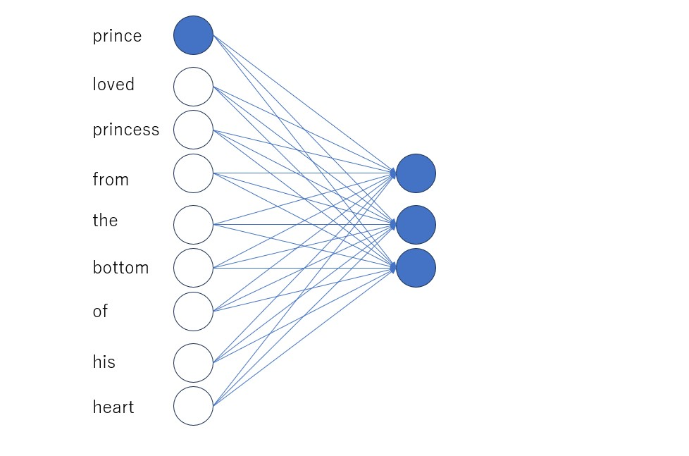
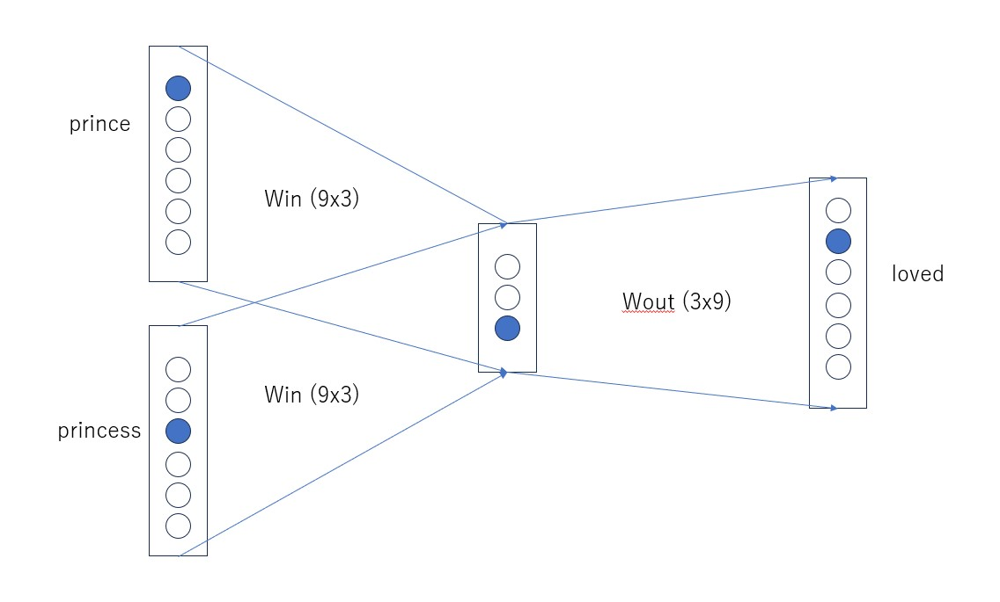
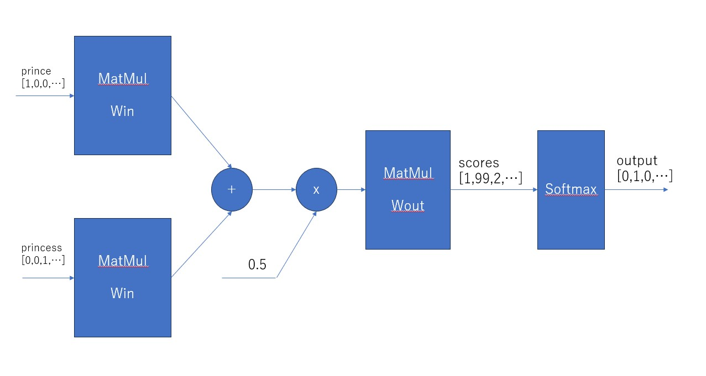

# Inference based word2vec
To derive vector representation of words, we'll explore inference based method as opposed to count based method.

As the name suggests this method derives vector representation by inferring the word based on its context, i.e., other words surrounding it. We'll see the famous word2vec neural networks model & learn this method by actually implementing it from scratch.

- Build simple word2vec
- We'll sacrifice interefficiency for interpretibility
- Hence we'll use a small dataset
- In the next chapter we'll introduce several improvements to the simple word2vec build in this chapter and complete more realistic word2vec

# Count based vs Inference based
There has been a lot of research conducted on deriving vector representation of the word. 2 methods among these researches proved successful.
- Count Based
- Inference Based

Both are based on the general principle of leveraging the distribution of words in big data set.

Both methods are known as distributional hypothesis.

We'll point out some disadvantages of count based method and advantages of inference based method.

## Disadvantages of count based method
- Count based method becomes computationally heavy when it processes very big datasets consisting of millions of words if not billions.

    For instance, the number of distinct words in an English corpus can reach \(10^6\). Building \(10^6 \times 10^6\) co-occurrence matrix and then applying SVD on it is computationally heavy. SVD requires \(O(n^3)\) time to process \(n \times n\) matrix.

- Count based method uses statistical information of the whole corpus and derives vector representation of words at once (by applying SVD) while inference based method derives vector representation of words by processing smaller portions of data one at a time rather than trying to use the whole big data at once.

    It reminds me of eating food by taking small bites rather than shoving the whole thing into your mouth. It is much easier to digest food in small chunks.

- We can use GPUs to accelerate learning of neural networks and parallel processing data.

# Inference based method definition

As demonstrated in the below example, this method tries to infer what word comes in ? mark (target word).


**Prince** *?* **princess** from the bottom of his heart.


In traditional machine learning, you feed data into your model in batches. Usually, your data columns correspond to individual features. Let's take the classification of flowers as an example. The color, the number of petals, the width, and the height of petals would be chosen as features. And you would train your model to classify a flower into a certain type based on these features.

| Color | No of Petals | Width | Height | Type |
|-------|--------------|-------|--------|------|
| red   | 4            | 3     | 5      | A    |
| blue  | 3            | 2     | 5      | B    |
| yellow| 4            | 4     | 5      | A    |
| green | 3            | 2     | 5      | B    |
| red   | 4            | 3     | 5      | A    |
| yellow| 3            | 2     | 9      | B    |
| green | 4            | 3     | 6      | A    |
| purple| 3            | 2     | 6      | B    |

When we express a word as a one-hot vector, we're treating each word as a feature. Every sample is also a word. Only the feature that matches that word will have a value of 1 and all other features will have value of 0.

## Processing of words by Neural Networks

We'll process words using Neural Networks. But it can not process text as is. We need to convert words to fixed size vectors, in order for NN to process them. One way is to express words as one hot vectors. One-hot vector is a kind of vector where one of its elements is 1 and all the others are zeros.


Passing every word to neural network with the aim to assign n input neurons, where n is the vocabulary size (9x1):



Above depicts a fully connected network. In fully connected networks, every node is connected to every other node of the next layer. Arrows streching from input nodes to output nodes represent multiplication by weights. We can express fully connected network as matrix multiplication of input with a weight matrix W.

```python
e = np.array([[1, 0, 0, 0, 0, 0, 0, 0, 0]])
W = np.random.random((9,3))
h = np.dot(e, W)
```

Small fact that we will return to later. Multiplication of one-hot vector with a Weight matrix is equivalent to extracting a particular row of the W matrix.

## CBOW Inference

CBOW (Continuous Bag of Words) is a Neural Network that infers target word from the context (surrounding words). By training this model to accurately predict the target word from the context, we derive vector representation of words.

We feed context, i.e., a list of words like "prince" and "princess", into the model and train it to output the target word like "loved". We convert input words into one-hot vectors so that the neural network can process them. The neural network will output scores corresponding to each word in the vocabulary.



* Input Layer: One-hot vectors of input words.
* Weight Matrices: Win (9x3), Wout (3x9)
* Hidden Layer: Intermediate processing layer.
* Output Layer: Scores corresponding to each word in the vocabulary.


As depicted in the figure, the NN accepts two inputs. It projects them to mid-layer using the same W_in weight matrix. The mid-layer is the mean of vectors resulted by matrix multiplication of inputs and W_in. For instance, if we feed 2 inputs each with shape [1,7] and multiply it by W_in [7,3] each will result in [1,3] vectors h1, and h2 and mid-layer is (h1 + h2) / 2.

NN eventually outputs 1x7 vector, a layer with 7 neurons. It is important to mark that each output neuron corresponds to an individual word in the vocabulary. You can interpret each value of output neuron as the score assigned to every word. The word with the highest score is the word that the model inferring as the target given the context.

W_in eventually becomes the matrix that governs vector representations of words. Every row of W_in will be vector representation of the word whose id matches that row.

[Note] The reason that mid-layer has fewer neurons than the input layer is that this way the model will encode the most important information in the input layer by squeezing bigger information into a smaller container. This is analogous to how you choose the most important things when you leave for a journey. You can't fit everything into your baggage so you choose the most vital items necessary for your journey.

This is the way of model learning the most important features about words, which eventually helps it derive their meanings in the form of vectors.

Let's see CBOW from layer perspective:



- **Input**: Takes in words as one-hot vectors.
- **Matrix Multiplication (MatMul)**: Words represented by one-hot vectors are multiplied by W_in to create hidden layer representations.
- **Summation and Division**: The representations are summed and averaged if multiple context words are input.
- **Second MatMul**: The averaged hidden layer is then multiplied by W_out.
- **Softmax**: A softmax function is applied to output probabilities corresponding to each word in the vocabulary.


```python
def create_contexts(corpus:List[int],window_size:int):
    targets = corpus[window_size : - window_size]
    contexts = []

    for idx in range(window_size, len(corpus)-window_size):
        cs = []
        for t in range(-window_size, window_size):
            if t == 0:
                continue
            cs.append(corpus[idx + t])
        contexts.append(cs)
    return np.array(contexts), np.array(targets)
```

