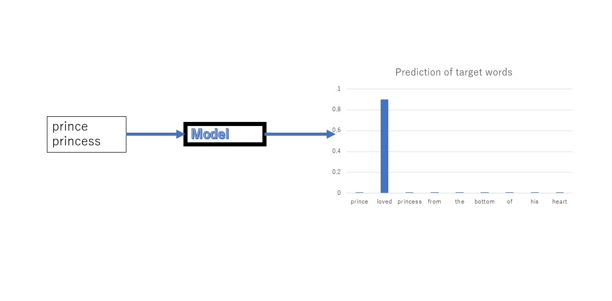
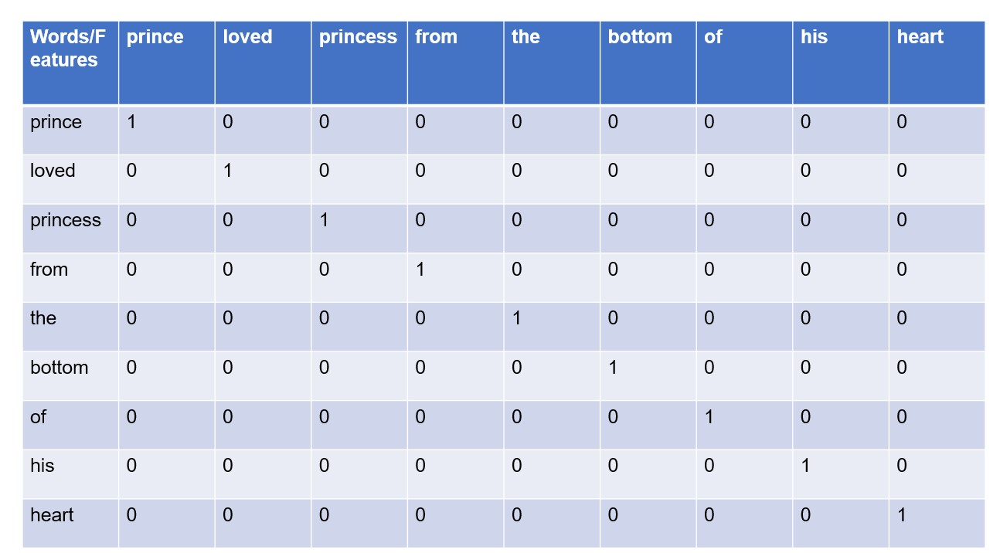

# Inference based word2vec
To derive vector representation of words, we'll explore inference based method as opposed to count based method.

As the name suggests this method derives vector representation by inferring the word based on its context, i.e., other words surrounding it. We'll see the famous word2vec neural networks model & learn this method by actually implementing it from scratch.

- Build simple word2vec
- We'll sacrifice interefficiency for interpretibility
- Hence we'll use a small dataset
- In the next chapter we'll introduce several improvements to the simple word2vec build in this chapter and complete more realistic word2vec

# Count based vs Inference based
There has been a lot of research conducted on deriving vector representation of the word. 2 methods among these researches proved successful.
- Count Based
- Inference Based

Both are based on the general principle of leveraging the distribution of words in big data set.

Both methods are known as distributional hypothesis.

We'll point out some disadvantages of count based method and advantages of inference based method.

## Disadvantages of count based method
- Count based method becomes computationally heavy when it processes very big datasets consisting of millions of words if not billions.

    For instance, the number of distinct words in an English corpus can reach \(10^6\). Building \(10^6 \times 10^6\) co-occurrence matrix and then applying SVD on it is computationally heavy. SVD requires \(O(n^3)\) time to process \(n \times n\) matrix.

- Count based method uses statistical information of the whole corpus and derives vector representation of words at once (by applying SVD) while inference based method derives vector representation of words by processing smaller portions of data one at a time rather than trying to use the whole big data at once.

    It reminds me of eating food by taking small bites rather than shoving the whole thing into your mouth. It is much easier to digest food in small chunks.

- We can use GPUs to accelerate learning of neural networks and parallel processing data.

# Inference based method definition

As demonstrated in the below example, this method tries to infer what word comes in ? mark (target word).


**Prince** *?* **princess** from the bottom of his heart.





## Processing of words by Neural Networks

We'll process words using Neural Networks. But it can not process text as is. We need to convert words to fixed size vectors, in order for NN to process them. One way is to express words as one hot vectors. One-hot vector is a kind of vector where one of its elements is 1 and all the others are zeros.



```python
def create_contexts(corpus:List[int],window_size:int):
    targets = corpus[window_size : - window_size]
    contexts = []

    for idx in range(window_size, len(corpus)-window_size):
        cs = []
        for t in range(-window_size, window_size):
            if t == 0:
                continue
            cs.append(corpus[idx + t])
        contexts.append(cs)
    return np.array(contexts), np.array(targets)
```